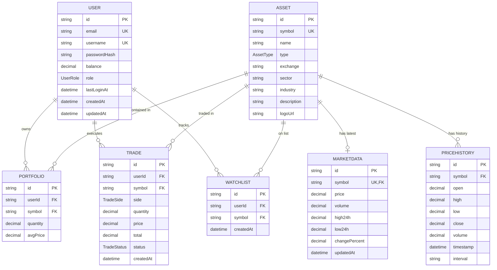

# Comprehensive ERD (Mermaid)

This diagram represents the full database schema as of April 2026.

## Data Types Note
- **Decimal**: Used for all financial values (Price, Balance, Quantity, Total). Precision is set to handle high-precision assets like Crypto (up to 8 decimal places for quantity).
- **CUID**: Used for all IDs.
- **Enums**: 
    - `AssetType`: STOCK, CRYPTO, ETF
    - `TradeSide`: BUY, SELL
    - `TradeStatus`: PENDING, EXECUTED, CANCELLED
    - `UserRole`: USER, ADMIN
