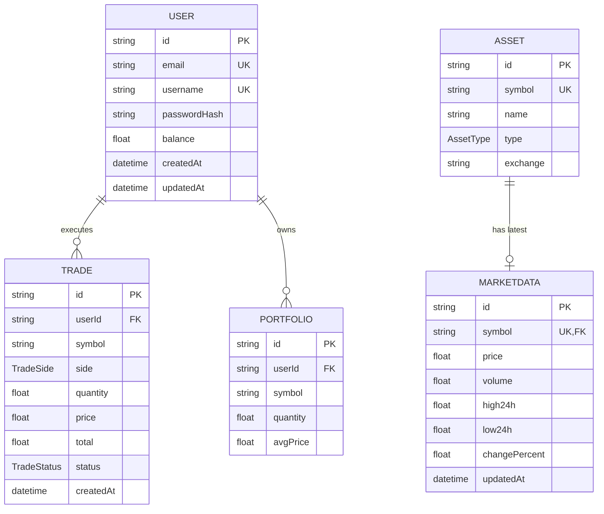

# Entity Relationship Diagram (ERD)

The following diagram illustrates the relationships between the core entities in the QuantSim database.

## Relationship Details

- **User and Trade (1:N):** One user can execute many trades. A trade always belongs to exactly one user.
- **User and Portfolio (1:N):** One user can own multiple portfolio entries (one per unique asset).
- **Asset and MarketData (1:1):** Each asset has exactly one corresponding market data snapshot, linked by the `symbol` field.
- **Portfolio/Trade and Asset:** Although not strictly enforced by a foreign key in the Prisma schema (which uses the `symbol` string), these models relate to the `Asset` registry conceptually.
