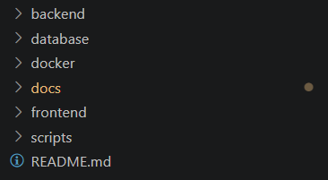
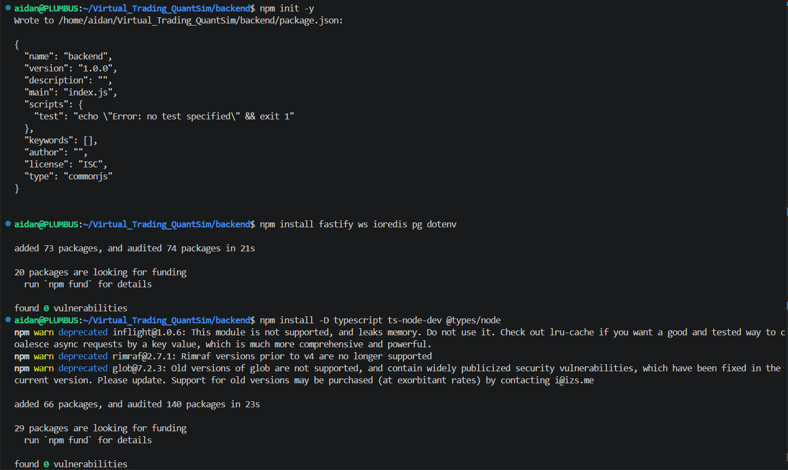
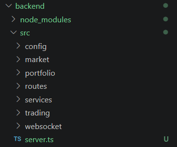

# QuantSim Roadmap

# 🚧 Phase 0 — Project Initialization

## 0.1 Create Project Structure



---

## 0.2 Initialize Backend (Node.js + TypeScript)



---

## 0.3 Setup TypeScript

```bash
npx tsc --init
```
#### tsconfig.json:
```json
{
  "compilerOptions": {
    "target": "ES2020",
    "module": "CommonJS",
    "rootDir": "./src",
    "outDir": "./dist",
    "strict": true,
    "esModuleInterop": true
  }
}
```

---

## 0.4 Setup Scripts (`package.json`)

```json
"scripts": {
  "dev": "ts-node-dev --respawn src/server.ts",
  "build": "tsc",
  "start": "node dist/server.js",
  "test": "echo \"Error: no test specified\" && exit 1"
},
```

---

## 0.5 Create Base Backend Structure



---

# ⚙️ Phase 1 — Core Backend Setup

## 1.1 Basic Fastify Server

`src/server.ts`

```ts
import Fastify from "fastify";

const app = Fastify();

app.get("/health", async () => {
  return { status: "ok" };
});

const start = async () => {
  try {
    await app.listen({ port: 3000, host: "0.0.0.0" });
    console.log("Server running on port 3000");
  } catch (err) {
    process.exit(1);
  }
};

start();
```

Test:

```bash
npm run dev
```

---

## 1.2 Environment Configuration

Install dotenv (already done)

Create `.env`:

```env
PORT=3000
DB_HOST=localhost
DB_PORT=5432
DB_USER=postgres
DB_PASSWORD=postgres
DB_NAME=quantsim
REDIS_HOST=localhost
REDIS_PORT=6379
```

Create `src/config/env.ts`:

```ts
import dotenv from "dotenv";
dotenv.config();

export const ENV = {
  PORT: process.env.PORT || 3000,
  DB_HOST: process.env.DB_HOST!,
  DB_PORT: Number(process.env.DB_PORT),
  DB_USER: process.env.DB_USER!,
  DB_PASSWORD: process.env.DB_PASSWORD!,
  DB_NAME: process.env.DB_NAME!,
};
```

---

## 1.3 PostgreSQL Connection

`src/services/db.ts`

```ts
import { Pool } from "pg";
import { ENV } from "../config/env";

export const db = new Pool({
  host: ENV.DB_HOST,
  port: ENV.DB_PORT,
  user: ENV.DB_USER,
  password: ENV.DB_PASSWORD,
  database: ENV.DB_NAME,
});
```

Test it with a simple query.

---

## 1.4 Redis Setup (Optional but Recommended)

`src/services/redis.ts`

```ts
import Redis from "ioredis";
import { ENV } from "../config/env";

export const redis = new Redis({
  host: ENV.REDIS_HOST,
  port: Number(ENV.REDIS_PORT),
});
```

---

# 🔌 Phase 2 — WebSocket Setup

## 2.1 Basic WebSocket Server

`src/websocket/server.ts`

```ts
import { WebSocketServer } from "ws";

export const initWebSocket = (server: any) => {
  const wss = new WebSocketServer({ server });

  wss.on("connection", (ws) => {
    console.log("Client connected");

    ws.send(JSON.stringify({ type: "WELCOME" }));

    ws.on("message", (msg) => {
      console.log("Received:", msg.toString());
    });
  });
};
```

---

## 2.2 Attach WebSocket to Fastify

Update `server.ts`:

```ts
import { initWebSocket } from "./websocket/server";

const start = async () => {
  const server = await app.listen({ port: 3000, host: "0.0.0.0" });
  initWebSocket(app.server);
};
```

---

# 🐳 Phase 3 — Docker Setup

## 3.1 Backend Dockerfile

`docker/Dockerfile.backend`

```dockerfile
FROM node:18

WORKDIR /app

COPY backend/package*.json ./
RUN npm install

COPY backend .

RUN npm run build

CMD ["node", "dist/server.js"]
```

---

## 3.2 Docker Compose

`docker/docker-compose.yml`

```yaml
version: "3.9"

services:
  backend:
    build:
      context: ..
      dockerfile: docker/Dockerfile.backend
    ports:
      - "3000:3000"
    env_file:
      - ../backend/.env
    depends_on:
      - db
      - redis

  db:
    image: postgres:14
    restart: always
    environment:
      POSTGRES_USER: postgres
      POSTGRES_PASSWORD: postgres
      POSTGRES_DB: quantsim
    ports:
      - "5432:5432"

  redis:
    image: redis:7
    ports:
      - "6379:6379"
```

---

## 3.3 Run Everything

```bash
cd docker
docker-compose up --build
```

---

# 🧠 Phase 4 — Core Trading Logic (Prototype)

## 4.1 Trade Engine (In-Memory First)

Create:

```bash
src/trading/engine.ts
```

Basic idea:

* Accept BUY/SELL orders
* Store in memory
* Immediately “fill” at market price

Do NOT build a full matching engine yet.

---

## 4.2 REST Endpoints

Create:

```bash
src/routes/trades.ts
```

Endpoints:

* `POST /trade` → place trade
* `GET /portfolio` → user holdings
* `GET /prices` → latest prices

---

## 4.3 WebSocket Events

Push to clients:

* price updates
* trade confirmations
* portfolio updates

---

# 📊 Phase 5 — Market Data

## 5.1 External API Integration

Create:

```bash
src/market/provider.ts
```

Responsibilities:

* fetch prices (polling or streaming)
* cache in Redis
* broadcast via WebSocket

---

# 🚀 Phase 6 — First Working Prototype

You are DONE when:

* Backend runs via Docker
* DB + Redis connected
* WebSocket streams live data
* User can:

  * place a trade
  * see price updates
  * see portfolio update

---

# ⚠️ Common Mistakes (Avoid These)

* Overengineering early (no microservices yet)
* Building full order book too soon
* Skipping Docker until “later”
* Hardcoding config instead of using `.env`

---

# 🎯 What “Prototype Complete” Means

Not pretty. Not scalable. But:

* Works end-to-end
* Real-time updates
* Trades execute
* Data persists

That’s it.

---

# 🎨 Phase 7 — Frontend Setup (React)

## 7.1 Initialize React + TypeScript

```bash
cd frontend
npm create vite@latest . -- --template react-ts
npm install
```

---

## 7.2 Install Frontend Dependencies

```bash
npm install react-router-dom zustand axios recharts tailwindcss
npm install -D tailwindcss postcss autoprefixer
npx tailwindcss init -p
```

---

## 7.3 Create Base Components

```bash
mkdir -p src/{components,pages,hooks,store}
touch src/{components/{Chart,TradeForm,Portfolio,OrderBook}.tsx,pages/{Dashboard,Trades}.tsx}
```

---

## 7.4 WebSocket Hook

`src/hooks/useWebSocket.ts`

```ts
import { useEffect, useState } from "react";

export const useWebSocket = (url: string) => {
  const [data, setData] = useState<any>(null);

  useEffect(() => {
    const ws = new WebSocket(url);
    ws.onmessage = (event) => {
      setData(JSON.parse(event.data));
    };
    return () => ws.close();
  }, [url]);

  return data;
};
```

---

## 7.5 Test Frontend

```bash
npm run dev
```

App runs at `http://localhost:5173`

---

# 🔥 Next Steps After Prototype

* Add authentication (JWT)
* Persist trades to database
* Improve trade execution logic
* Add real order matching engine
* Integrate with live market data APIs
* Add advanced charts and analytics
* Performance optimization and scaling

---
